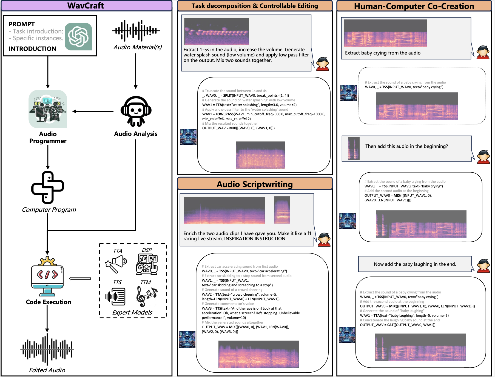

# 🌊WavCraft

[](https://arxiv.org/abs/2403.09527)    [](https://first-riddle-7e9.notion.site/WavCraft-Demo-40c079fc82ca411ca0520b9d65abd3f5)

Generate and edit the audio with a simple sentence.

This repo currently support:

* text-guided audio editing: edit the content of given audio clip(s) conditioned on text input
* text-guided audio generation: create an audio clip given text input
* audio scriptwriting: get more inspiration from WavCraft by prompting a script setting and let the model do the scriptwriting and create the sound for you.
* check if your audio file is synthesized by WavCraft

## Change log

**2024-05-06**: Support openLLMs (MistralAI family) for WavCraft.

**2024-03-20**: Add watermarking to the system

## Content

- [Usage](##usage)
  - [Installation](###installation)
  - [Audio edition using a single line](###audio-edition-using-a-single-line)
  - [Audio edition via interaction](###audio-edition-via-interaction)
  - [Check if an audio file is generated/modified by WavCraft](###check_if_an_audio_file_is_generated/modified_by_wavcraft)
- [Approach](##approach)
- [Acknowledgments](##acknowledgments)
- [Citing](##citing)

## Usage

### Installation

```
source scripts/setup_envs.sh
```

## Configure environment

```bash
export OPENAI_KEY=YOUR_OPENAI_KEY
export HF_KEY=YOUR_HF_KEY
```

### Audio edition using a single line

```
python3 WavCraft.py basic -f \
--input-wav assets/duck_quacking_in_water.wav \
--input-text "Add dog barking."
```

### Audio edition via interaction

```
python3 WavCraft-chat.py basic -f -c
[New session is create]
Add audio files(s) (each file starts with '+'): +assets/duck_quacking_in_water.wav
Enter your instruction (input `EXIT` to exit the process): "Add dog barking"

```

### Check if an audio file is generated/modified by WavCraft

```
python3 check_watermark.py --wav-path /path/to/audio/file
```

### Use openLLMs for generation/editing
```
python3 WavCraft.py basic -f \
--input-wav assets/duck_quacking_in_water.wav \
--input-text "Add dog barking." \
--model 'mistralai/Mistral-7B-Instruct-v0.2'
```

## Approach

WavCraft is an LLM-driven agent for audio content creation and editing. It applies LLM to connect various audio expert models and DSP function together. An overview of WavCraft architecture can be found bellow:



## Disclaimer

This repository is for **research purpose only**. We are not responsible for audio generated/edited using semantics created by this model. Also, everyone use WavCraft must NOT disable the watermarking techniques in anyway.

## Acknowledgments

We appreciate [WavJourney](https://github.com/Audio-AGI/WavJourney), [AudioCraft](https://github.com/facebookresearch/audiocraft), [AudioSep](https://github.com/Audio-AGI/AudioSep), [AudioSR](https://github.com/haoheliu/versatile_audio_super_resolution), [AudioLDM](https://github.com/haoheliu/AudioLDM), [WavMark](https://github.com/wavmark/wavmark) for their amazing code work.

## Citing

If you found our work is helpful, please cite our work:
```
@misc{liang2024wavcraft,
      title={WavCraft: Audio Editing and Generation with Large Language Models}, 
      author={Jinhua Liang and Huan Zhang and Haohe Liu and Yin Cao and Qiuqiang Kong and Xubo Liu and Wenwu Wang and Mark D. Plumbley and Huy Phan and Emmanouil Benetos},
      year={2024},
      eprint={2403.09527},
      archivePrefix={arXiv},
      primaryClass={eess.AS}
}
```
